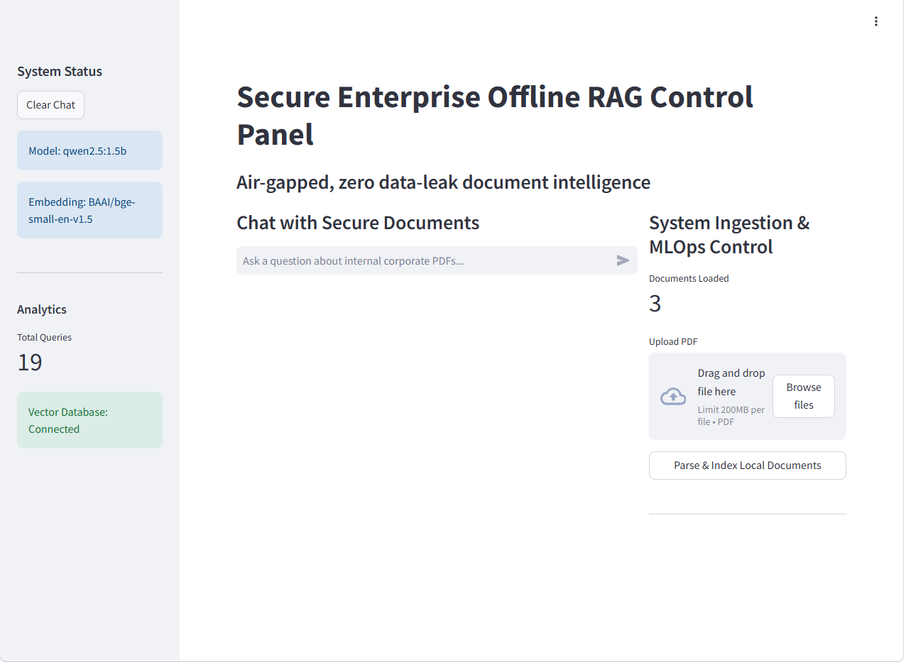
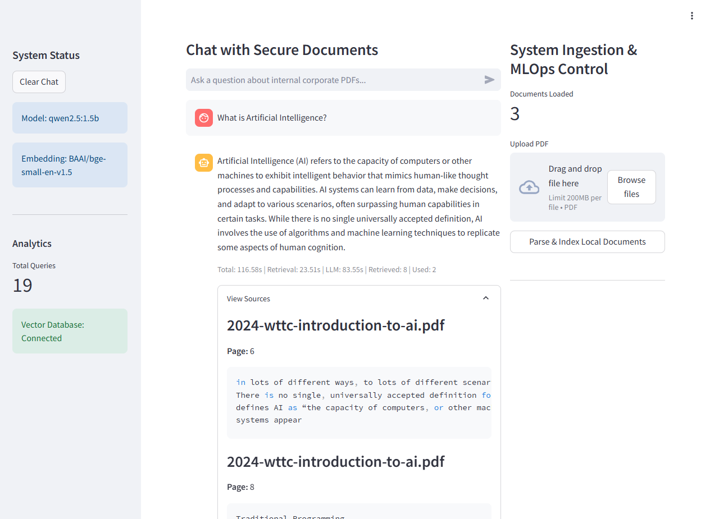
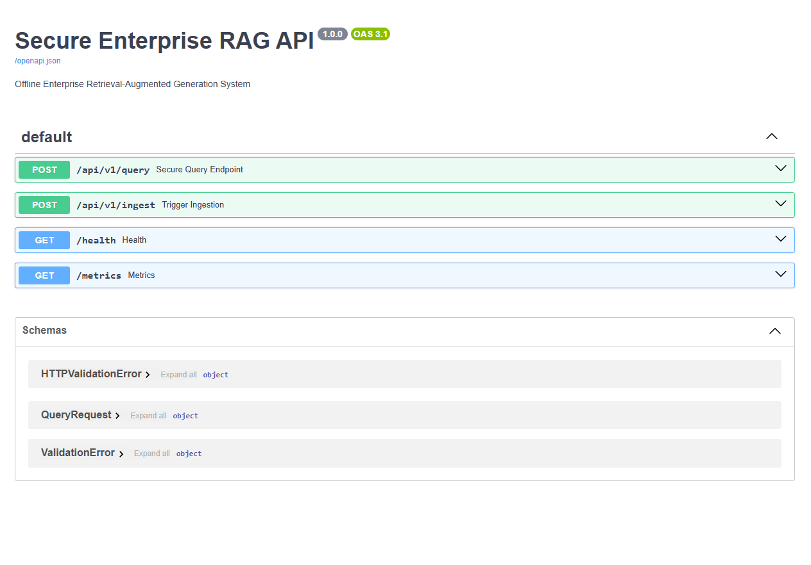

# Enterprise Private RAG: Secure Offline Document Intelligence Pipeline

## Key Features

* Hybrid Retrieval (BM25 + ChromaDB Vector Search)
* CrossEncoder Re-ranking using BAAI/bge-reranker-base
* Fully Offline Enterprise Deployment (No OpenAI APIs Required)
* Multi-PDF Document Intelligence Platform
* Source Attribution & Citation Support
* Conversation Memory
* FastAPI REST API
* Streamlit Chat Dashboard
* Local LLM Inference via Ollama
* RAGAS Evaluation Framework
* Dockerized Deployment
* Query Analytics & Observability


An air-gapped, high-privacy Retrieval-Augmented Generation (RAG) system designed for enterprise deployment. This pipeline allows organizations to securely query sensitive corporate intelligence (PDFs, internal documentation, financial reports) entirely on-premise, guaranteeing zero data leakage to external APIs or the public internet.

## Enterprise Privacy Architecture:

Unlike standard RAG implementations that rely on cloud-hosted services (like OpenAI or Pinecone), this system enforces a strict data-isolation boundary. Every stage of the data lifecycle—from ingestion to text generation—is executed locally on machine hardware.

## Architecture

```text
                        ┌─────────────────┐
                        │ Corporate PDFs  │
                        └────────┬────────┘
                                 │
                                 ▼
                    ┌────────────────────────┐
                    │ PDF Loader & Chunking  │
                    └────────┬───────────────┘
                             │
                             ▼
                  ┌─────────────────────────┐
                  │ BGE Embedding Model     │
                  └────────┬────────────────┘
                           │
                           ▼
                     ┌──────────────┐
                     │ ChromaDB     │
                     └──────┬───────┘
                            │
                            ▼

User Query
     │
     ▼

┌──────────────┐      ┌──────────────┐
│ Vector Search│      │ BM25 Search  │
└──────┬───────┘      └──────┬───────┘
       └──────────┬──────────┘
                  ▼
      ┌─────────────────────────┐
      │ Hybrid Retriever        │
      └──────────┬──────────────┘
                 ▼
      ┌─────────────────────────┐
      │ CrossEncoder Reranker   │
      └──────────┬──────────────┘
                 ▼
      ┌─────────────────────────┐
      │ Ollama (Qwen2.5)        │
      └──────────┬──────────────┘
                 ▼
      ┌─────────────────────────┐
      │ Grounded Response       │
      │ + Source Citations      │
      └─────────────────────────┘
```


## Key Engineering Guardrails:

* No Network Overheads: Data never leaves the secure hosting perimeter.

* Open Source Foundations: Built using optimized HuggingFace embedding models and local Llama 3 execution via Ollama.

* Persistent Local Ingestion: Vector spaces are mapped to secure disk storage using ChromaDB, eliminating volatile cloud memory dependencies.

---

## Technical Stack & Architectural Choices

* **Framework:** `LangChain` (Modular orchestration layer separating data ingestion from the generation pipeline).
* **Document Processing:** `Unstructured` (Handles complex PDF document layouts, removing metadata artifacts and maintaining layout context).
* **Vector Database:** `ChromaDB` (A lightweight, fast, and embedded vector store running completely on local disk storage).
* **Embeddings:** `BAAI/bge-small-en-v1.5` (Top-tier, lightweight open-source embedding model running locally via PyTorch).
* **Re-ranking:** `BAAI/bge-reranker-base` (Cross-Encoder re-ranker used to re-score and sort context blocks for maximum accuracy).
* **Local Inference Engine:** `Ollama / Llama3 (8B)` (Quantized meta-model optimized for high-throughput, low-latency text completion on consumer or enterprise workstations).
* **User Interface:** `Streamlit` (Interactive, pure-Python web control panel and chat dashboard).
* **Evaluation Suite:** `Ragas` & `HuggingFace Datasets` (Automated LLM-as-a-judge quality engineering loop).

---

## Project Structure

The codebase strictly adheres to modular Software Engineering practices, abstracting operational logic into discrete components:

```text
private-rag-enterprise/
├── src/
│   ├── config.py          # Centralized hyperparameter & environment configurations
│   ├── logger.py          # Enterprise structured logging subsystem
│   ├── ingest.py          # Secure local binary parsing & recursive token chunking
│   ├── vector_store.py    # Embedding generation and persistent local database mapping
│   ├── reranker.py        # Cross-Encoder neural re-ranking layer
│   ├── llm_pipeline.py    # Context collection and offline LLM execution loop
│   ├── evaluator.py       # Ragas data-quality evaluation pipelines
│   ├── app.py             # Enterprise REST API layer (FastAPI baseline layout)
│   └── dashboard.py       # Streamlit UI Graphical User Control Panel
├── tests/
│   └── test_pipeline.py   # Unit testing suite configuration
├── Dockerfile             # Production OCI container orchestration blueprint
├── requirements.txt       # Production-pinned dependency configuration
└── README.md              # System architecture documentation
```

---

## Data Pipeline Execution Flow

### 1. Context-Preserving Ingestion
Documents drop directly into a guarded `/data` directory. The pipeline reads documents using a `RecursiveCharacterTextSplitter` with a strict token budget (`chunk_size=500`, `chunk_overlap=50`). This prevents cross-context pollution while retaining syntactic boundaries like sentences and paragraphs.

### 2. Advanced Two-Stage Retrieval
Raw text chunks are converted to vectors and mapped onto a local directory structure. When a user asks a question, standard vector search retrieves the top candidates. These candidates are passed through a `CrossEncoder` re-ranker, which evaluates cross-attention scores to pick the absolute highest-relevance contexts.

### 3. Air-Gapped Contextual Synthesis
The retrieved raw context blocks are wrapped inside a rigid system prompt template instructing the model to combat hallucinations. The prompt and query are fed through a local loop into an offline instance of Llama 3, producing an enterprise-accurate response with deterministic constraints.

### 4. MLOps Automated Quality Auditing
Using the `Ragas` layer, the system programmatically executes automated benchmarks across fixed golden query evaluation cycles, tracking three primary operational data metrics:
* **Faithfulness**: Mathematically validates if the answer is grounded *solely* in the retrieved documents (catches hallucinations).
* **Answer Relevance**: Scores whether the model directly addressed the user's specific prompt requirements.
* **Context Precision**: Audits the vector store retriever to ensure the extracted document chunks were clean and highly relevant.

---

## Kubernetes Deployment

The application supports containerized deployment through Kubernetes.

```bash
kubectl apply -f k8s/configmap.yaml
kubectl apply -f k8s/deployment.yaml
kubectl apply -f k8s/service.yaml
```

Resources:

* Deployment
* Service
* ConfigMap

This enables scalable deployment of the FastAPI-based RAG platform in Kubernetes environments.

---

## How to Execute the Application (Laptop Deployment)

### Running the Backend REST API
```bash
uvicorn src.app:app --host 0.0.0.0 --port 8000
```

### Running the Web Dashboard & Chat Control Panel
```bash
streamlit run src/dashboard.py
```

## Performance Metrics

| Component                | Performance   |
| ------------------------ | ------------- |
| ChromaDB Collection Size | 3,370 Chunks  |
| Retrieval Latency        | ~0.05s        |
| Re-ranking Latency       | ~1s           |
| Local LLM Inference      | 10-25s        |
| Documents Indexed        | 667 Pages     |
| RAGAS Answer Relevancy   | 0.83          |
| Deployment Mode          | Fully Offline |

---

## Engineering Improvements Implemented

* Reduced retrieval latency from ~19s to ~0.05s using BM25 index caching.
* Added Hybrid Search combining semantic and keyword retrieval.
* Implemented CrossEncoder re-ranking to improve context precision.
* Added conversation memory for multi-turn document Q&A.
* Added source-grounded responses with page-level citations.
* Integrated RAGAS evaluation pipeline for automated quality validation.
* Added FastAPI and Streamlit interfaces for API and UI access.

---

## Screenshots

### Streamlit Dashboard



### Query Response



### FastAPI Swagger

